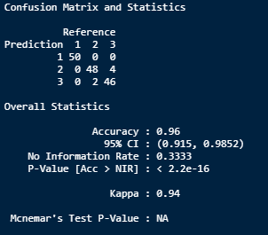
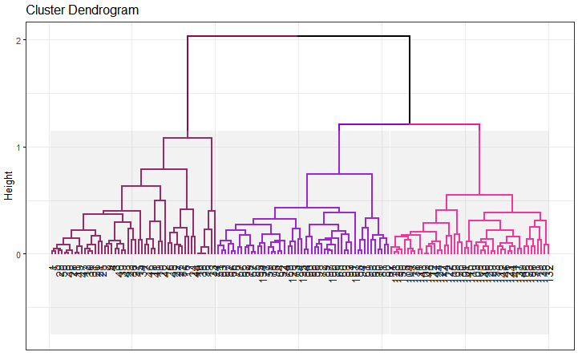

# Iris Species Clustering Classification
This is my own version of the known exercise of Iris Species ML Classification. I've reached 96% of recognition in my Confussion Matrix. Hope you like it, and also feel free to download and explore all the code! 

### **Confussion Matrix that shows the accuracy of the ML algorithm** ###

### **Dendrogram that shows the accuracy of the ML algorithm** ###

